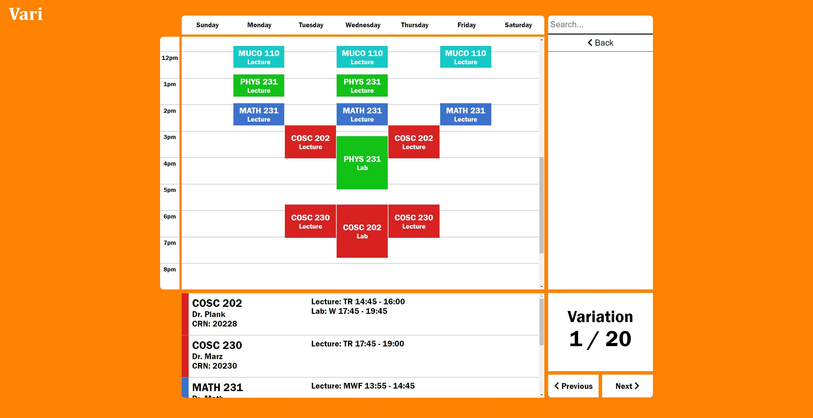

# Vari

## University of Tennessee Knoxville - VolHacks V Hackathon (2021)
### Jovan Yoshioka, Dong Jun Woun

Countless hours are spent on creating the perfect university schedule.
Manually creating schedules is inconvenient and inefficient.
Our tool can shorten the time spent on class registration.

Try it out [here](https://jovanyoshioka.github.io/Vari)!

Technical Requirements:
- assets/fontawesome-5.15.3
